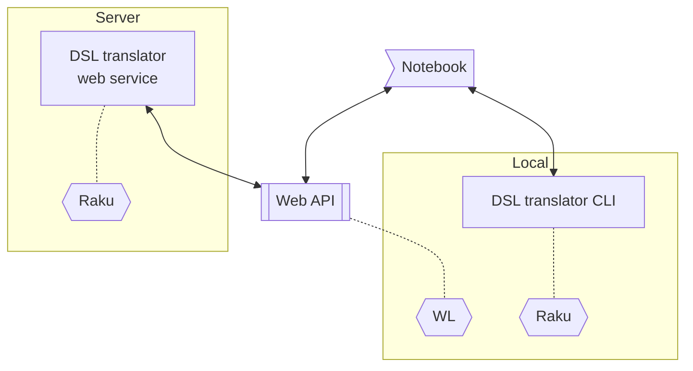

# DSLTranslation WL paclet

Wolfram Language (aka Mathematica) paclet for translation of natural language commands into code.

- Domain Specific Language (DSL) translation can be done via a Web service or an (OS Shell) Command Line Interface (CLI) command.
- By default a Web service is used, with the URL: "http://accendodata.net:5040/translate".
- By default the output is copied to the clipboard. (Code results can be just pasted and executed.)
- There are signatures and options that allow the specification of the from- and to-language used in DSL the translation.

This diagram summarizes the notebook-server and notebook-CLI interactions:



------

## Usage examples

Generate Wolfram Language (WL) code for Latent Semantic Analysis (LSA) command:

```mathematica
DSLTranslation["use aDocs; create document term matrix; extract 20 topics; show topics table"]
```

```
LSAMonUnit[aDocs]⟹LSAMonMakeDocumentTermMatrix[]⟹LSAMonExtractTopics["NumberOfTopics" -> 20]⟹LSAMonEchoTopicsTable[]
```


Translate LSA command from English to Python:

```mathematica
DSLTranslation["create document term matrix", "Python"]
```

```
".make_document_term_matrix( )"
```

Translate classifier creation command from English to Bulgarian:

```mathematica
DSLTranslation["create a random forest classifier", "English" -> "Bulgarian"]
```
```
"тренирай класификатор с метод: random forest"
```